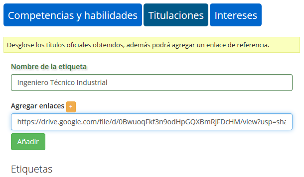
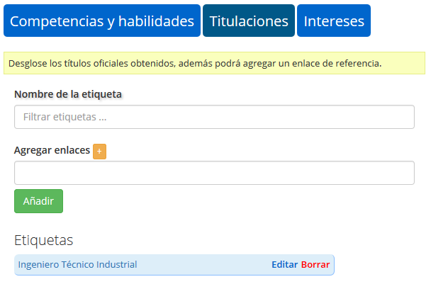
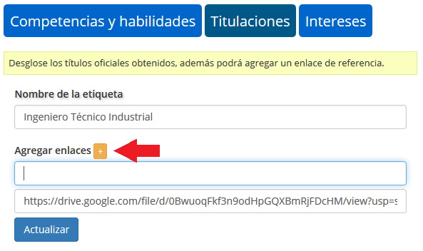
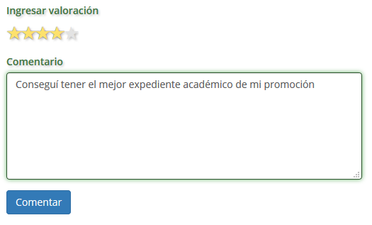
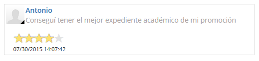

.. _GoWork: http://gowork.es
.. _Google Drive: https://drive.google.com

Funcionalidades
===============

Acreditación de etiquetas
-------------------------

`GoWork`_ te permite añadir información de valor de forma individual a tus etiquetas de formación, competencias o habilidades.

Puedes añadir cuantos enlaces creas convenientes a tus etiquetas en el mismo momento que la creas, o actualizar las existentes o incluir nuevas una vez que ya la tengas guardada en tu perfil.

**Ejemplo**

Quiero colocar mi titulación de Ingeniero Técnico Industrial. Además me gustaría poder demostrar que tengo esta titulación, para lo que agrego un enlace del título digitalizado que tengo en `Google Drive`_

Una vez dentro de mi perfil, en la pestaña de Títulos de mi administrador de etiquetas incluyo el nombre de mi titulación y el enlace del título digitalizado.

	
Al pulsar sobre el botón **añadir** se inserta la etiqueta en mi perfil que podré **editar** o **borrar**

 .. note:: 	Si pulso **borrar** se borrará toda la información que contenga la etiqueta para siempre. Este paso no se puede deshacer.
 
 Si queremos incluir alguna otra referencia: expediente académico, mención de honor, PFG o cualquier otro reconocimiento académico, lo podré hacer pulsando sobre el botón **editar** de la etiqueta.
 

 
 De esta forma podremos añadir cuantos enlaces creamos convenientes pulsando sobre el botón **+** que aparece a la derecha de "Nombre de la etiqueta" e introduciendo la :term:`URL` del enlace al documento que queramos compartir.
 

	
Al pulsar sobre el botón **actualizar** regresaremos al editor de etiquetas.

Tambien desde este apartados podremos añadir comentarios pulsando sobre el botón **editar** de la etiqueta agregando al comentario una valoración en forma de rango de estrellas.
 

	
Una vez escrito, pulsando en **comentar** y se nos fijaría el comentario dentro de la etiqueta. Para ver el comentario volveríamos a pulsar sobre editar.

Este comentario se fijará como un twit en donde figurará quién a realizado el comentario, con qué valoración y comentario y en que fechea lo ha realizado.