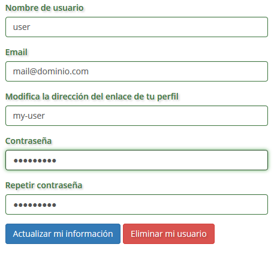

.. _GoWork: http://gowork.es
.. _Mi perfil: http://gowork.es/site/profile
.. _PrimoPDF: http://www.primopdf.com/es/

Perfil de usuario
=================

Felicidades, ya te has registrado `GoWork`_ y ahora podrás configurar todos los datos y 
disfrutar de las funcionalidades.

Una vez que ingreses encontrarás la siguiente imagen:

.. image:: img/panel-user-registered.png
    :align: center
    :alt: panel usuario registrado en gowork

Desde donde podrás acceder a:

 * Editar acceso
 * Editar perfil
 * Administrador de etiquetas
 * Ver perfil
 
Editar acceso
-------------
En editar acceso puedes actualizar todos los parámetros de acceso a tu perfil

	
Estos parámetros son: 
 
 * **Nombre de usuario** que es el nombre que utilizas para acceder al perfil de `GoWork`_
 * **Email** que es el mail donde recibirás todas las comunicaciones de `GoWork`_.
   Tambien podrás acceder a tu perfil utilizando tu dirección de mail.
 * **Dirección del enlace a tu perfil** con el que puedes personalizar la :term:`URL` de tu
   perfil
   
 .. note:: 	Por defecto la dirección de tu enlace corresponderá al nombre completo con el
			que has realizado tu registro.
			
 * **Contraseña** podrás actualizar tu contraseña de acceso a tu pefil en `GoWork`_
 
Una vez actualizados los datos que creas conveniente podrás pulsar sobre **Actualizar mi información** para guardar los cambios.
 
Tambien puedes **Eliminar mi usuario**, en este caso se eliminará **sin confirmación** toda la información que has generado en `Gowork`_
 
 .. note:: 	Tras pulsar Eliminar mi usuario **NO podrás deshacer los cambios** y tanto tu
            perfil como toda la información que has generado (archivos, comentarios a otros
			usuarios, etc.) serán borrados automáticamente.

Para regresar a tu perfil sólo tienes que puslar sobre `Mi perfil`_. 
			
Editar perfil
-------------
En esta sección puedes incluir la información más relevante que quires mostrar de forma
pública en tu pefil de `GoWork`_

De forma general, a cualquier tipo de usuario, puedes:
 * **Cargar imagen** de tu pefil.
 * Definir tu **nombre completo** de perfil.
 * Indicar una **descripción corta** a modo de eslogan, propuesta de valor, etc.
 * Indicar una **descripción larga** mediante un potente editor de texto interactivo y amigable. a modo de carta de presentación, presentación de productos o servicios, etc.
 * **Agregar vídeo** mediante la carga de un archivo MP4 o indicando la ::term::`URL` del vídeo subido a las plataformas de youtube o vimeo.
 * **Agragar enlaces sociales** de cualquier tipo. El sistema detecta automáticamente el tipo de red (facebook, twitter, linkedin, blog, etc.) al que hace referencia
 
 .. note:: 	La ::term::`URL' que quieran agregar deberá comenzar por http:// o https://
			según sea el caso. Sin esta descripción el sistema no detectará correctamente la ::term::`URL`
 
Una vez que incluyes tu información más relevante la puedes actualizar en tu perfil pulsando el botón inferior **Actualizar informción**.

Si no quieres guardar los cambios pusla en en botón inferior **Regresar a mi perfil**.

... como Persona
^^^^^^^^^^^^^^^^
Como usuario ::term::`Persona` en tu pefil exite un campo que no tienen el resto de usuarios.

En tu perfil puedes cargar, actualizar o eliminar tu currículum simplemente cargando el archivo en formato word (.doc o .docx) o PDF.

 .. note:: 	Recomendamos que tu currículum esté en formato PDF ya que al ser un formato
			reconocido internacionalmente evitarás poblemas a la hora de su lectura por cualquier navegador o lector.
			
.. tip:: 	Si no tienes ningún programa para generar el archivo puedes utilizar la versión
			gratuita de `PrimoPDF`_.
			

... como Empresa
^^^^^^^^^^^^^^^^

... como Universidad
^^^^^^^^^^^^^^^^^^^^

Administrador de etiquetas
--------------------------
 
Ver perfil
----------
 
 Pulsando sobre el botón de ver perfil visualizaremos el aspecto que tiene nuestro perfil de forma pública.
 
 .. image:: img/view-my-profile.png
    :align: center
    :alt: vista perfil público usuario registrado en gowork
 
 Para regresar a las opciones de mi perfil debo pulsar sobre el menú `Mi peril`_ que aparece en la parte superior derecha.
 
Ayuda editor de texto
---------------------