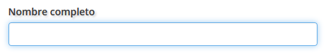

.. _GoWork: http://gowork.es
.. _Mi perfil: http://gowork.es/site/profile
.. _PrimoPDF: http://www.primopdf.com/es/

Perfil de usuario
=================

Felicidades, ya te has registrado `GoWork`_ y ahora podrás configurar todos los datos y 
disfrutar de las funcionalidades.

Una vez que ingreses encontrarás la siguiente imagen:

.. image:: img/panel-user-registered.png
    :align: center
    :alt: panel usuario registrado en gowork

Desde donde podrás acceder a:

 * Editar acceso
 * Editar perfil
 * Administrador de etiquetas
 * Ver perfil
 
Editar acceso
-------------
En editar acceso puedes actualizar todos los parámetros de acceso a tu perfil

.. image:: img/edit-profile.png
    :align: center
    :alt: Formulario para editar los parámetros de acceso al perfil
	
Estos parámetros son: 
 
 * **Nombre de usuario** que es el nombre que utilizas para acceder al perfil de `GoWork`_
 * **Email** que es el mail donde recibirás todas las comunicaciones de `GoWork`_.
   Tambien podrás acceder a tu perfil utilizando tu dirección de mail.
 * **Dirección del enlace a tu perfil** con el que puedes personalizar la :term:`URL` de tu
   perfil
   
 .. note:: 	Por defecto la dirección de tu enlace corresponderá al nombre completo con el
			que has realizado tu registro.
			
 * **Contraseña** podrás actualizar tu contraseña de acceso a tu pefil en `GoWork`_
 
Una vez actualizados los datos que creas conveniente podrás pulsar sobre **Actualizar mi información** para guardar los cambios.
 
Tambien puedes **Eliminar mi usuario**, en este caso se eliminará **sin confirmación** toda la información que has generado en `Gowork`_
 
 .. note:: 	Tras pulsar Eliminar mi usuario **NO podrás deshacer los cambios** y tanto tu
            perfil como toda la información que has generado (archivos, comentarios a otros
			usuarios, etc.) serán borrados automáticamente.

Para regresar a tu perfil sólo tienes que puslar sobre `Mi perfil`_. 
			
Editar perfil
-------------
En esta sección puedes incluir la información más relevante que quires mostrar de forma
pública en tu pefil de `GoWork`_

De forma general cualquier tipo de usuario puede:
 * **Cargar imagen** de tu pefil.
 * Definir tu **nombre completo** de perfil.
 * Indicar una **descripción corta**.
 * Indicar una **descripción larga** mediante un potente editor de texto.
 * **Agregar vídeo** mediante la carga de un archivo MP4 o la :term:`URL` de un vídeo subido a las plataformas de youtube o vimeo.
 * **Agragar enlaces sociales** de cualquier tipo. El sistema detecta automáticamente el tipo de red (facebook, twitter, linkedin, blog, etc.) al que hace referencia
 
 .. note:: 	La URL que quieran agregar deberá comenzar por **http://** o **https://**
			según sea el caso. Sin esta descripción el sistema no detectará correctamente la URL
 
Una vez que incluyes tu información más relevante la puedes actualizar en tu perfil pulsando el botón inferior **Actualizar informción**.

Si no quieres guardar los cambios pusla en en botón inferior **Regresar a mi perfil**.

A continuación se explica el detalle de cada información y aspectos exclusivos para cada perfil.

... como Persona
^^^^^^^^^^^^^^^^

Cargar imagen
"""""""""""""

Al pulsando el botón **Browse ...**	se abre una ventana que te permite seleccionar el archivo de imagen de tu perfil. En tu caso sería una foto personal.

Lo que nunca debes hacer en tu foto de perfil:

  * Dejar el blanco la foto de tu perfil (evidente)
  * Poner una foto desactualizada (de hace mucho tiempo)
  * Colocar una foto de mala calidad (pixelada, borrosa, etc.)
  * Colocar una foto de caricatura (¿estas de broma?)

Te facilitamos 8 trucos para que tengas una foto de perfil profesional (Fuente: `Vicente Nadal <https://opinionesopinables.wordpress.com/2013/10/02/trucos-para-tener-una-buena-foto-de-perfil/>`_)
 
 #. **Se original**. La originalidad vende, marca tu diferencia, te hace original y reconocible. Usa formatos de imagen o complementos en la fotografía que la hagan única.
 #. Si te define una afición o tu profesión busca el modo de integrarlo en tu fotografía como complementos, escenarios, atuendos, etc.
 #. Escoge un buen día para hacerte las fotos, tómate tu tiempo, no hagas las fotos con prisa. La tensión emocional se refleja en la cara, en la rigidez muscular de nuestras facciones.
 #. La base de un buen retrato es un 90% de psicología y un 10% de fotografía de modo que tómatelo con calma, relájate y déjate llevar por tu fotógrafo profesional Sólo él sabe cómo contactar con tu “mejor yo” y hacerlo salir a la superficie.
 #. La mayoría de las fotos de perfil en las redes sociales miran a la izquierda ¿te habías fijado? No es casualidad. Empezamos a leer por la izquierda, nuestra mirada se topa con la foto entrando por los ojos. Si tu rostro mira a la derecha, la mirada del observador se encuentra con tu nuca y no con tus ojos, le das la espalda al observador y no la bienvenida.
 #. Mira a los ojos a tu visitante. Una mirada clara y penetrante comunica sensaciones positivas, una mirada fuera del encuadre de la foto puede ser interpretado como timidez o una actitud altiva dependiendo del resto de la foto. Tampoco puedes hacerte fotos con gafas de sol puestas.
 #. La ropa es muy importante. En algunos casos las fotos de perfil son muy pequeñas, como en Twitter, pero igual necesitas una foto para tu Web, Blog o para el perfil de Linkedin que tiene una foto más grande. Tu ropa habla por ti de tus gustos, modo de expresarte y comunicarte, de tus aficiones etc. Por cierto, tampoco puedes hacerte fotos con las gafas sobre la cabeza, queda muy mal.
 #. Cuida tu `lenguaje corporal <https://es.wikipedia.org/wiki/Comunicaci%C3%B3n_no_verbal>`_ . No es indiferente que cruces los brazos de un modo u otro, las manos en los bolsillos o incluso el tipo de mueca o semblante en tu cara. Todo comunica y dice de ti.

**Nombre completo**
"""""""""""""""""""

	
En esta casilla puedes indicar tu nombre y apellidos o el nombre por el cual quieres que te recuerden. Este dato aparecerá en tu perfil público.

	

Como usuario :term:`Persona` en tu pefil exite un campo que no tienen el resto de usuarios.

En tu perfil puedes cargar, actualizar o eliminar tu currículum simplemente cargando el archivo en formato word (.doc o .docx) o PDF.

 .. note:: 	Recomendamos que tu currículum esté en formato PDF ya que al ser un formato
			reconocido internacionalmente evitarás poblemas a la hora de su lectura por cualquier navegador o lector.
			
.. tip:: 	Si no tienes ningún programa para generar el archivo puedes utilizar la versión
			gratuita de `PrimoPDF`_.
			

... como Empresa
^^^^^^^^^^^^^^^^

... como Universidad
^^^^^^^^^^^^^^^^^^^^

Administrador de etiquetas
--------------------------
 
Ver perfil
----------
 
 Pulsando sobre el botón de ver perfil visualizaremos el aspecto que tiene nuestro perfil de forma pública.
 
 .. image:: img/view-my-profile.png
    :align: center
    :alt: vista perfil público usuario registrado en gowork
 
 Para regresar a las opciones de mi perfil debo pulsar sobre el menú `Mi peril`_ que aparece en la parte superior derecha.
 
Ayuda editor de texto
---------------------