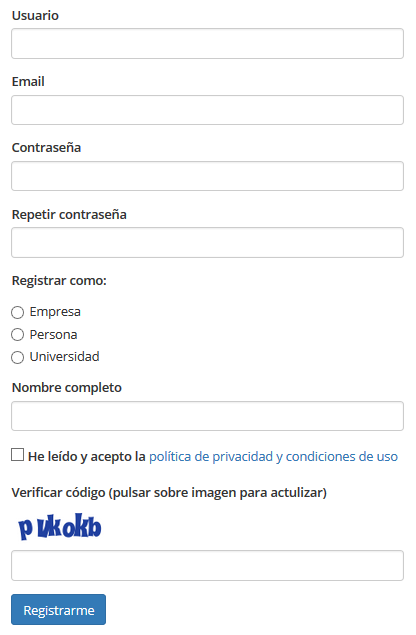

.. _GoWork: http://gowork.es
.. _Registrarse: http://gowork.es/site/signup

Registarse en GoWork
====================

Registrar tu perfil en `GoWork`_ es muy sencillo y rápido, sólo has de seguir los siguientes pasos:

1) Accede
----------
Puls sobre el menú `Registrarse`_ que podrás ver en la parte superior derecha 
de `GoWork`_

2) Rellena el formulario
------------------------
El formulario contiene los siguientes campos:

**Usuario**: Escribe tu nombre de usuario o nick. Este nombre será privado.

**Email**: Debes indicar tu mail de contacto.

**Contraseña**: Escribe una contraseña segura y fácil de recordar. A continuación deberás de confirmar la misma contraseña.

**Resgistrar como**: GoWork identifica tres tipos de perfil:

 * :term:`Empresa`.
 * :term:`Persona`.
 * :term:`Universidad`.

.. note:: 	¡Analiza el siginifcado de cada tipo de perfil y selecciona aquel que mejor se ajusta a tus necesidades!

**Nombre completo**: Será el nombre completo del usuario, por ejemplo Nombre Apellido o Normbre de la empresa, etc.

.. tip:: 	Por defecto este nombre será el utilizado para referenciar su perfil de forma que si se registra como una persona de nombre "David Nieto", la dirección de su perfil sería http://gowork.es/perfil/persona/David-Nieto. La dirección de su perfil siempre la podrá modificar desde su panel de control.

**Código de verificación**: Debe introducir el código que muestre la imagen. En caso de no
lograr interpretarlo puede actualizar la imagen pulsando sobre la misma.

**Registrarme**: Cuando tenga el formulario cumplimentado sólo tendrá que pulsar en el botón
Registrarme para hacer efectivo su registro y comenza a disfrutar de su perfil en `GoWork`_

.. note:: 	Automáticamente, se enviará un mail de **bienvenida** a tu email 
            para recordarte la contraseña utilizada. Revisa la sección de SPAM si no lo encuentras en tu bandeja de entrada principal.
